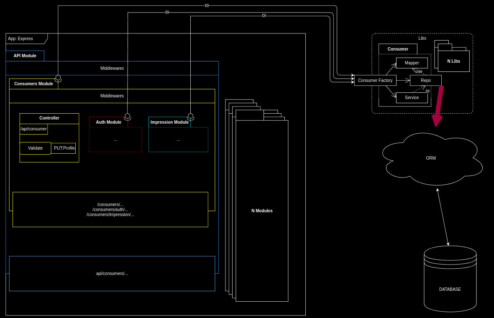

<h3 align="center">architecture-template</h3>
<p align="center"> Node js project example
    <br> 
</p>

<p align="center"> 
*This is only example it is not source of truth!!!
</p>

## 📝 Table of Contents

- [About](#about)
- [Getting Started](#getting_started)
- [High level description](#high-level)


## 🧐 About <a name = "about"></a>

This repository serves as an illustrative example of how to effectively organize a small Node.js project. Throughout this project, we've incorporated various practices and principles from different architectural approaches. This template can be utilized as a foundational framework for developing any Node.js application, providing a solid base for architectural organization and project structure. The key highlights include
- modular
- di, ioc

## 🏁 Getting Started <a name = "getting_started"></a>

These instructions will get you a copy of the project up and running on your local machine for development and testing purposes.

  1. Copy **.env.example** to **.env** file
  2. Copy **ecosystem.config.example.js** to **ecosystem.config.js** file 
  3. ```sudo docker-compose build```
  4. ```sudo docker-compose up```

### Prerequisites

```
Docker
Docker-Compose
```

### Migration TODO

```
TODO
```

## High level description<a name = "high-level"></a>



### Parts description
In this section, we will discuss the key concepts, components, and hierarchical levels. It is essential to recognize that we must distinguish between three fundamental elements: domain, infrastructure, and application. When considering dependencies, the domain should serve as the cornerstone of our application, with the other components relying on the domain for their functionality.

If we talk about dependency and architecture we need to reverse dependecy to Domain, we talk about Inversion of Control and Dependency Injection.

**JS dont have parameters types and for this project we use manual DI approach.

#### App.js
This serves as the primary entry point where all logic originates. It initiates an instance of the Server class, which, in turn, creates a new Express app. 
This class retrieves top-level modules, such as the API module, and initializes all root-level middlewares.

#### <MODULE>/*
This represents a module, such as a api module, which is a fundamental building block of our routing structure.
These modules can be interconnected, forming a hierarchical structure. For instance, you can create a nested hierarchy of modules, allowing for a flexible and organized approach to routing
  /api
    /users
  OR
  /api
    /users
      -create
      -update
      -read
      /products
        -read
        -update

Our objective is to establish a versatile routing system that enables us to easily relocate modules to different levels or even isolate them into separate servers. 
This approach allows us to construct our routing architecture akin to assembling Lego pieces, offering us flexibility and scalability.

##### *.module.js
The '*.module.js' file serves as the entry point for the module. Within this class, we initialize submodules and controllers.
This is where we implement manual Dependency Injection (DI) and export an instance of the Module.
Additionally, we use the Lib Factory to inject our Application service into the controllers, specifically providing access to App Services.

```js
module.exports = new ConsumerModule([
  new ConsumerController(consumerFactory.service()),
  new ConsumerAuthController(authFactory.service(), consumerFactory.service()),
  imprassionModule,
]);
```

##### *controller.js
The '*.controller.js' file houses the Controller class. 
This class acts as the bridge between the route and Application logic, facilitating the mapping of data from the application level to the HTTP API level when necessary. Inside this file, you will discover the controller implementation, complete with its dependencies injected through the constructor.
```js
  /**
   * @constructs ConsumerController
   */
  constructor(consumerService) {
    super('profile');
    this._consumerService = consumerService;
    this._consumerMapper = consumerFactory.mapper();
  }
```

Method example
```js

  /**
   * Consumer get profile.
   * @method
   * @param {Object} - Express request object
   * @param {Object} - Express response object
   * @param {Function} - Express next function
   */
  index(request, response, next) {
    const { user } = request;
    this._consumerService
      .profile(user)
      .then((profile) => {
        this.ok(response, this._consumerMapper.toEntity(profile));
      })
      .catch(next);
  }
```

### LIBS/*

We utilize two types of services: Application services (consumed by the application) and utility services (dealing with arrays, files, etc.). Application services are particularly crucial to us.

Given that JavaScript is a dynamically-typed language, traditional Dependency Injection (DI) by abstraction isn't available. However, our goal is to decouple different parts of the application. To achieve this, we employ additional files, such as Factories or Adapters, enabling us to achieve the desired decoupling

#### .factory.js
The lib facade acts as the primary entry point for utilizing the library's services.
To access a library service, you must employ the lib factory, which furnishes you with the required service instance. This approach offers several advantages. 
It allows us to replace service implementations and modify service construction in a single location, streamlining the process of making changes.

For example, when we need to pass the User service to the Auth service, we simply navigate to the Auth.factory.js file and provide the service as a constructor argument. 
In contrast, without this setup, we would need to modify multiple files each time we initialize the Auth service, introducing complexity and potential errors.

```js
/**
 * Class representing a ConsumerFactory
 * @class
 * @memberOf Libs.Consumer
 */
class ConsumerFactory {
  /**
   * Create Service instance
   * @param {Object} options - The options object.
   * @return {Object} Service instance.
  */
  service(options = {}) {
    return new ConsumerService(
      this.repo(),
      impressionFactory.service()
    );
  }

  /**
   * Create Repo instance
   * @param {Object} options - The options object.
   * @return {Object} Repo instance.
  */
  repo(options = {}) {
    return new ConsumerRepo();
  }

  /**
   * Create Mapper instance
   * @param {Object} options - The options object.
   * @return {Object} Payment Mapper instance.
  */
  mapper(options = {}) {
    return new ConsumerMapper();
  }
}
```

#### .service.js
This is where all of business logic will live, and it should be used to call methods on other classes in order to perform actions that are related
All of Application and Domain logic

#### .repo.js
Database operations, queries or transactions that are not related to the business rules (e.g., CRUD) should be placed in Repository layer.
So it is adapter for our ORM system this file hepls as to decouple system with database
Instance of repo we alwais pass by DI to service and use in it for work with DB.

#### .mapper.js
This class helps us map data from one format to another, so that we can easily convert between them without worrying about the details
This class helps us map data from one format (DB) into another, so that we can easily access the domain layer without worrying about it
